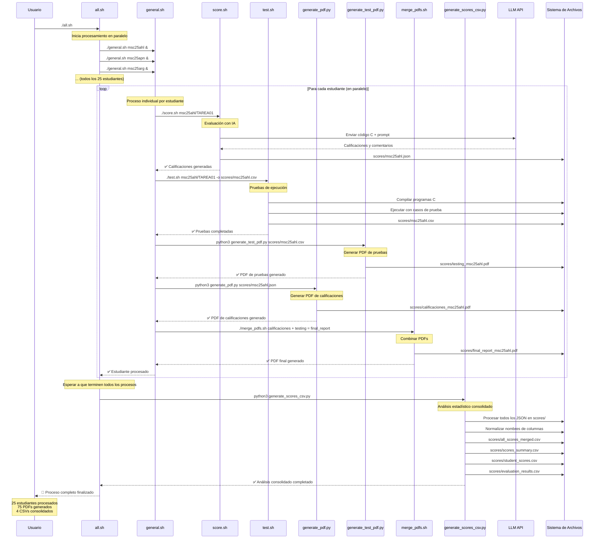
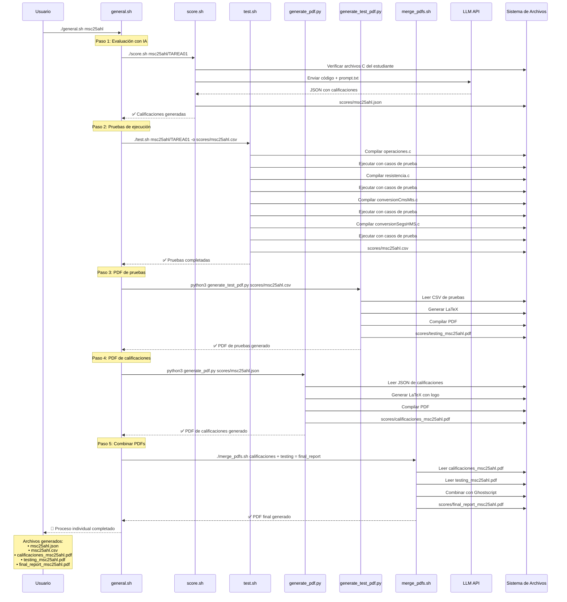
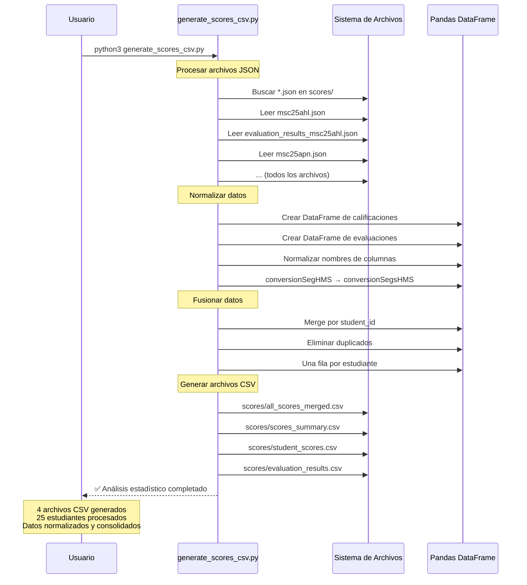

# Sistema de Evaluación Automática de Programas C

Este sistema automatiza la evaluación de programas C de estudiantes, generando calificaciones detalladas, reportes PDF estéticos y análisis estadísticos completos.

## 📋 Tabla de Contenidos

- [Descripción General](#descripción-general)
- [Requisitos del Sistema](#requisitos-del-sistema)
- [Instalación](#instalación)
- [Estructura del Proyecto](#estructura-del-proyecto)
- [Flujo de Trabajo](#flujo-de-trabajo)
- [Archivos Generados](#archivos-generados)
- [Uso del Sistema](#uso-del-sistema)
- [Diagrama de Secuencia](#diagrama-de-secuencia)
- [Troubleshooting](#troubleshooting)

## 🎯 Descripción General

El sistema evalúa automáticamente programas C de estudiantes en cuatro categorías:
- **operaciones.c**: Operaciones básicas (suma, resta, multiplicación, división, residuo)
- **resistencia.c**: Cálculo de resistencia eléctrica
- **conversionCmsMts.c**: Conversión de centímetros a metros y centímetros
- **conversionSegsHMS.c**: Conversión de segundos a horas, minutos y segundos

### Características Principales

- ✅ **Evaluación automática** con IA (LLM)
- ✅ **Pruebas de ejecución** automatizadas
- ✅ **Reportes PDF estéticos** con logo institucional
- ✅ **Análisis estadístico** completo
- ✅ **Procesamiento en lote** de múltiples estudiantes
- ✅ **Generación de CSV** para análisis de datos

## 🔧 Requisitos del Sistema

### Software Base
- **macOS** (desarrollado en macOS 24.6.0) o **Linux**
- **Bash** 4.0+
- **Python** 3.8+
- **Git**

### Herramientas de Desarrollo
- **GCC** (compilador C)
- **Ghostscript** (para manipulación de PDFs)
- **LaTeX** (para generación de PDFs)

### Python Dependencies
```bash
# Instalar en el entorno virtual
pip install pandas>=2.3.0
pip install numpy>=1.26.0
pip install python-dateutil>=2.8.2
pip install pytz>=2020.1
pip install tzdata>=2022.7
pip install six>=1.5
```

### Herramientas Externas
- **llm** (Simon Willison's LLM CLI tool)
- **Ghostscript** (`gs` command)
- **LaTeX** (para compilación de PDFs)

## 🚀 Instalación

### Instalación Automática (Recomendada)
```bash
# Ejecutar script de instalación automática
./install.sh
```

### Instalación Manual

#### macOS
```bash
# Instalar Ghostscript
brew install ghostscript

# Instalar LaTeX (MacTeX)
brew install --cask mactex

# Instalar llm
pip install llm

# Configurar llm con tu API key
llm keys set openai

# Crear entorno virtual
python3 -m venv .venv
source .venv/bin/activate
pip install -r requirements.txt
```

#### Ubuntu/Debian
```bash
# Instalar Ghostscript
sudo apt-get install ghostscript

# Instalar LaTeX
sudo apt-get install texlive-full

# Instalar llm
pip install llm

# Crear entorno virtual
python3 -m venv .venv
source .venv/bin/activate
pip install -r requirements.txt
```

## 📁 Estructura del Proyecto

```
EJ01/
├── 📁 msc25*/                    # Directorios de estudiantes
│   └── TAREA01/
│       ├── operaciones.c
│       ├── resistencia.c
│       ├── conversionCmsMts.c
│       └── conversionSegsHMS.c
├── 📁 scores/                    # Directorio de resultados
│   ├── 📄 *.json                 # Calificaciones individuales
│   ├── 📄 *.csv                  # Resultados de pruebas
│   ├── 📄 *.pdf                  # Reportes PDF
│   ├── 📄 all_scores_merged.csv  # ⚡ GENERADO: Datos consolidados
│   ├── 📄 scores_summary.csv     # ⚡ GENERADO: Resumen estadístico
│   ├── 📄 student_scores.csv     # ⚡ GENERADO: Solo calificaciones
│   └── 📄 evaluation_results.csv # ⚡ GENERADO: Solo resultados de evaluación
├── 📁 public/
│   └── ibero.png                 # Logo institucional
├── 📁 _logs/                     # Logs del sistema
├── 📄 all.sh                     # ⚡ SCRIPT: Procesamiento en lote
├── 📄 general.sh                 # ⚡ SCRIPT: Proceso individual
├── 📄 score.sh                   # ⚡ SCRIPT: Evaluación con IA
├── 📄 test.sh                    # ⚡ SCRIPT: Pruebas de ejecución
├── 📄 merge_pdfs.sh              # ⚡ SCRIPT: Combinación de PDFs
├── 📄 generate_pdf.py            # ⚡ SCRIPT: Generación de PDFs
├── 📄 generate_test_pdf.py       # ⚡ SCRIPT: PDF de pruebas
├── 📄 generate_scores_csv.py     # ⚡ SCRIPT: Análisis estadístico
├── 📄 prompt.txt                 # Prompt para evaluación con IA
└── 📄 README.md                  # Este archivo
```

### Archivos Generados Automáticamente

| Archivo | Descripción | Generado por |
|---------|-------------|--------------|
| `scores/*.json` | Calificaciones individuales | `score.sh` |
| `scores/*.csv` | Resultados de pruebas | `test.sh` |
| `scores/calificaciones_*.pdf` | PDF de calificaciones | `generate_pdf.py` |
| `scores/testing_*.pdf` | PDF de pruebas | `generate_test_pdf.py` |
| `scores/final_report_*.pdf` | PDF combinado | `merge_pdfs.sh` |
| `scores/all_scores_merged.csv` | Datos consolidados | `generate_scores_csv.py` |
| `scores/scores_summary.csv` | Resumen estadístico | `generate_scores_csv.py` |
| `scores/student_scores.csv` | Solo calificaciones | `generate_scores_csv.py` |
| `scores/evaluation_results.csv` | Solo evaluaciones | `generate_scores_csv.py` |

## 🔄 Flujo de Trabajo

### 1. Evaluación Individual (`general.sh`)
```bash
./general.sh msc25ahl
```

**Proceso:**
1. **Evaluación con IA** (`score.sh`) → Genera `msc25ahl.json`
2. **Pruebas de ejecución** (`test.sh`) → Genera `msc25ahl.csv`
3. **PDF de pruebas** (`generate_test_pdf.py`) → Genera `testing_msc25ahl.pdf`
4. **PDF de calificaciones** (`generate_pdf.py`) → Genera `calificaciones_msc25ahl.pdf`
5. **Combinación de PDFs** (`merge_pdfs.sh`) → Genera `final_report_msc25ahl.pdf`

### 2. Procesamiento en Lote (`all.sh`)
```bash
./all.sh
```

**Proceso:**
- Ejecuta `general.sh` para todos los estudiantes en paralelo
- Genera todos los archivos individuales
- Al finalizar, ejecuta `generate_scores_csv.py` para análisis consolidado

### 3. Análisis Estadístico (`generate_scores_csv.py`)
```bash
source .venv/bin/activate
python3 generate_scores_csv.py
```

**Proceso:**
- Procesa todos los archivos JSON del directorio `scores/`
- Normaliza nombres de columnas (conversionSegHMS → conversionSegsHMS)
- Genera 4 archivos CSV consolidados
- Crea un registro por estudiante (sin duplicados)

## 🚀 Uso del Sistema

### Evaluación de un Estudiante
```bash
# Evaluar un estudiante específico
./general.sh msc25ahl

# Verificar archivos generados
ls -la scores/msc25ahl.*
```

### Evaluación de Todos los Estudiantes
```bash
# Procesar todos los estudiantes en paralelo
./all.sh

# Verificar progreso
ps aux | grep general.sh
```

### Análisis Estadístico
```bash
# Activar entorno virtual
source .venv/bin/activate

# Generar análisis consolidado
python3 generate_scores_csv.py

# Ver resultados
head scores/scores_summary.csv
```

### Verificación de Archivos
```bash
# Contar archivos generados
ls scores/*.pdf | wc -l
ls scores/*.json | wc -l
ls scores/*.csv | wc -l

# Verificar tamaño de archivos
du -sh scores/
```

## 📊 Diagrama de Secuencia

### Flujo Principal: Evaluación en Lote



### Flujo Detallado: Evaluación Individual



### Flujo de Análisis Estadístico



### Archivos Generados por Flujo

#### Flujo Individual (general.sh)
```
scores/
├── msc25ahl.json                    # Calificaciones de IA
├── msc25ahl.csv                     # Resultados de pruebas
├── calificaciones_msc25ahl.pdf      # PDF de calificaciones
├── testing_msc25ahl.pdf             # PDF de pruebas
└── final_report_msc25ahl.pdf        # PDF combinado final
```

#### Flujo en Lote (all.sh)
```
scores/
├── msc25ahl.*, msc25apn.*, ...      # Archivos individuales (25 estudiantes)
├── all_scores_merged.csv            # ⚡ GENERADO: Datos consolidados
├── scores_summary.csv               # ⚡ GENERADO: Resumen estadístico
├── student_scores.csv               # ⚡ GENERADO: Solo calificaciones
└── evaluation_results.csv           # ⚡ GENERADO: Solo evaluaciones
```

## 🔍 Troubleshooting

### Problemas Comunes

#### 1. Error de LLM
```bash
# Verificar configuración de llm
llm keys list

# Reconfigurar si es necesario
llm keys set openai
```

#### 2. Error de Ghostscript
```bash
# Verificar instalación
which gs

# Instalar si no está disponible
brew install ghostscript  # macOS
sudo apt-get install ghostscript  # Ubuntu
```

#### 3. Error de LaTeX
```bash
# Verificar instalación
which pdflatex

# Instalar si no está disponible
brew install --cask mactex  # macOS
sudo apt-get install texlive-full  # Ubuntu
```

#### 4. Error de Pandas
```bash
# Activar entorno virtual
source .venv/bin/activate

# Instalar dependencias
pip install pandas numpy
```

#### 5. Archivos PDF corruptos
```bash
# Verificar PDFs
gs -q -dNOPAUSE -dBATCH -sDEVICE=nullpage scores/*.pdf

# Regenerar si es necesario
rm scores/*.pdf
./all.sh
```

### Logs del Sistema
```bash
# Ver logs de procesamiento
ls -la _logs/

# Ver logs en tiempo real
tail -f _logs/copy_FPROGRAOT25_TAREA01_*.csv
```

### Verificación de Integridad
```bash
# Verificar que todos los estudiantes fueron procesados
ls scores/*.json | wc -l
ls scores/*.pdf | wc -l

# Verificar archivos CSV consolidados
head scores/scores_summary.csv
```

## 📈 Estadísticas del Sistema

- **Estudiantes procesados**: 25
- **Programas evaluados por estudiante**: 4
- **Archivos JSON generados**: 25
- **Archivos PDF generados**: 75 (3 por estudiante)
- **Archivos CSV consolidados**: 4
- **Tiempo promedio por estudiante**: ~2-3 minutos
- **Tiempo total de procesamiento**: ~60-75 minutos

## 🤝 Contribuciones

Para contribuir al proyecto:

1. Fork el repositorio
2. Crea una rama para tu feature (`git checkout -b feature/nueva-funcionalidad`)
3. Commit tus cambios (`git commit -am 'Agregar nueva funcionalidad'`)
4. Push a la rama (`git push origin feature/nueva-funcionalidad`)
5. Crea un Pull Request

## 📄 Licencia

Este proyecto está bajo la Licencia MIT. Ver el archivo `LICENSE` para más detalles.

## 👥 Autores

- **Sistema de Evaluación**: Desarrollado para el curso de Programación I
- **Instituciones**: Universidad Iberoamericana
- **Año**: 2025

---

*Última actualización: Septiembre 2025*
